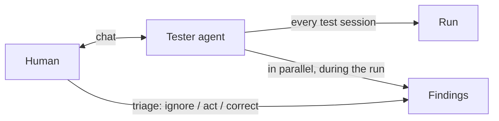
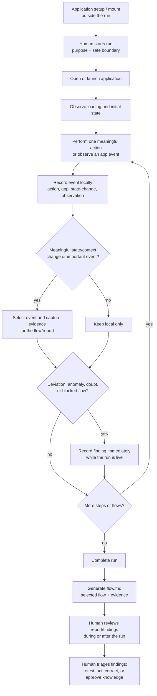
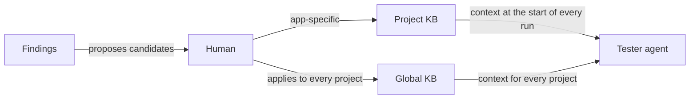
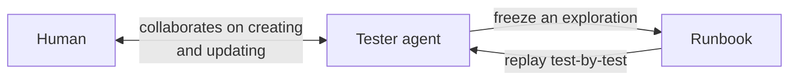
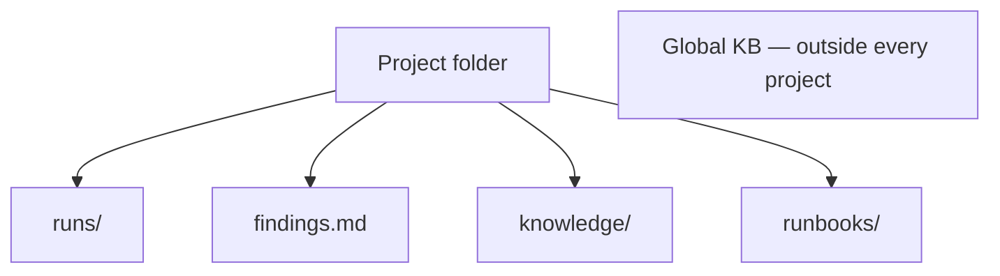

# Tester System — Design Document

*This document defines the structure of the tester system: its components, its documents, their formats, and their rules. The implementation document and all implementation work derive from this design.*

---

## 1. Overview

The tester agent tests desktop applications like a human QA tester. Testing produces knowledge; knowledge must outlive the conversation that created it. The system is therefore organised around **documents** — each with a defined purpose, producer, consumer, format, and rules — and around **projects**, which scope those documents to a single application under test.

### 1.1 System interaction

The interaction is shown as small diagrams instead of one tangled one: the core testing flow, the detailed runtime testing flow, the knowledge flow, the runbook's two directions, and where documents live.

**(a) Core testing flow** — the human talks to the tester; the tester records what it does and what it notices:



**Runtime testing flow** — the run is more than a list of tester actions. Setup or mounting the application is a one-time prerequisite, not a test interaction. Once the human starts a run with its purpose and boundary, the tester proceeds autonomously while recording the complete event history locally and the selected test flow durably:



The human may monitor status and inspect evidence while the run is active or
after it completes, but the tester should not pause for human input at every
step. It communicates when a bounded recovery fails, the application is
blocked, or a decision is required. A stuck flow is recorded as a finding; if
another independent flow is safe to run, the tester may continue with it and
summarise the blocked flow at completion. The durable `flow.md` is the selected
test flow described in the transcript. `report.md` is retained as a generated
compatibility copy for existing consumers. A bug-reproduction flow is the
evidence exception: record the extra steps and screenshots needed to recreate it.

**(b) Knowledge flow** — knowledge reaches the tester only through the human, and every run starts with what the KBs know. The human decides whether a fact belongs to one project or to every project:



**(c) Runbook — both input and output.** The human only ever talks to the tester: runbook creation, updating, and approval all happen in conversation with the tester, which then writes the runbook file. The tester can freeze an exploration into a runbook, and replay a runbook as a run:



**(d) Where the documents live** — everything inside a project; the global KB is the single exception:



### 1.2 Roles

| Role | Responsibility |
|------|----------------|
| Human | Talks directly to the tester. Sets targets and boundaries. Triages findings. Owns the KB. Dictates or approves runbooks. |
| Tester agent | Runs tests and creates tests (runbooks). Writes the run and findings documents. Maintains project index files. Proposes KB entries — never commits them without human confirmation. |
| Builder agent | Future, separate agent that will fix applications. **Out of scope for the current design.** Tasks, as its input format, are deferred until the builder's shape is known. |

### 1.3 Execution modes

Every test session runs in exactly one of three modes:

| Mode | Behaviour |
|------|-----------|
| Explore | Open-ended. The tester wanders the application and reports what it notices. |
| Continue | The tester reads the most recent run, replicates its final steps, and resumes from there. |
| Runbook | The tester executes a stored runbook test-by-test, recording one event per step and a pass/fail per test. |

**Rule:** every tester execution that tests the application produces a run document. The single exception is authoring a runbook — creating a runbook is not a test and produces no run record.

---

## 2. Projects

All tester work is scoped to a **project** — one application under test. Every document belongs to a project; there are no valid tester documents outside project scope (the global KB, section 8, is the only exception).

### 2.1 Project folder

```
tester-data/
├── index.md                 ← bundle-root listing (the only file allowed to carry okf_version)
├── global-knowledge.md      ← cross-project KB (section 8; the only document outside project scope)
└── projects/
    └── gd-math/
        ├── index.md              ← directory listing: setup, runs, findings, knowledge, runbooks
        ├── setup.md              ← app location, how to launch, setup notes
        ├── runs/                 ← one folder per run (section 3)
        ├── findings.md           ← human-readable findings (section 4; durable)
        ├── findings.jsonl        ← local machine record behind findings.md; never committed
        ├── knowledge/            ← project KB (section 5)
        └── runbooks/             ← one markdown file per runbook (section 6)
```

### 2.2 Markdown follows the Open Knowledge Format (OKF v0.2)

Every human-facing Markdown document is written in the Open Knowledge Format
(Google's open spec for portable, cross-linked Markdown that agents read).
This keeps the tester's documents readable by humans, parseable by any agent,
and portable out of the workspace with no lock-in — and it gives every document
a machine-identifiable type and provenance for free.

- Every non-index `.md` file is a **concept**: it starts with YAML frontmatter
  carrying a non-empty `type` (e.g. `Run`, `Findings`, `Runbook`, `Knowledge`,
  `App Setup`) plus `title`, `description`, `tags`, and a `generated` block
  naming who produced it and when.
- `index.md` files (bundle root, project, knowledge) are **directory listings**
  without frontmatter — one link per line with a short description, grouped
  under section headings. The bundle-root `index.md` may carry `okf_version`.
- **Links are relationships**: run report ↔ project index, finding ↔ run,
  runbook ↔ source run (in its `sources` frontmatter and body).
- `validate` enforces conformance: every concept file must carry a parseable
  frontmatter with a non-empty `type`.

### 2.3 Project index.md

The project `index.md` is a pure OKF directory listing (generated by the
tester's tooling after every store operation that changes it), with sections
for Setup, Runs, Findings, Knowledge, and Runbooks. Launch instructions and
setup notes live in `setup.md`, so the index stays a listing and the setup
details stay an editable concept document.

A runbook does not repeat the target — it resolves it from `setup.md` at
execution time.

### 2.4 Project lifecycle rules

### 2.3 Project lifecycle rules

1. Every conversation with the tester starts with a project context.
2. If the human hands the tester an application with no matching project, the tester **creates the project first**: records how to run it in `setup.md`, then proceeds.
3. If a request arrives without project context, the tester asks: work with an existing project, or create a new one?
4. Project folders sit under a single parent (`tester-data/projects/`). A future migration into a repository is expected; the parent-folder layout must not preclude it.

---

## 3. Document 1 — Run

**Purpose.** The factual record of one testing session while its local event history is retained. It is evidence, not opinion.

**Producer.** The tester, automatically, while testing.
**Consumers.** The human (to verify a finding's evidence) and the tester (in continue mode, to replicate prior steps).

### 3.1 Location and layout

One folder per run; the raw record, the human report, and the evidence live together so a run is moved or archived as a unit:

```
runs/<run-id>/
├── events.jsonl      ← local, high-volume event stream; one JSON object per line
├── flow.md           ← selected human-readable test flow (OKF concept; durable)
├── report.md         ← generated compatibility copy of flow.md
└── artifacts/        ← selected screenshots and captures referenced by events
```

`events.jsonl` is working storage, not a repository artefact. It may instead be
materialised in a local database, but the logical stream is called **events**,
not actions: an action is only one kind of event. JSON/JSONL machine records
are never committed; see section 10. The report contains only selected events,
so it is not a second copy of the high-volume stream.

Screenshots are taken on a 1280×720 virtual display with the pointer position
overlaid on the capture — a screenshot without a cursor makes pointer-driven
actions look like phantom effects. Captures are capped at 1280px width; the
app itself is launched at the display resolution where possible (Godot builds
usually accept `--resolution 1280x720`).

`run-id` format: `YYYYMMDD-HHMM-<slug>` (e.g. `20260901-1300-gd-math`). Run ids are unique and never reused.

### 3.2 Event records (events.jsonl)

The atomic unit of a run is an **event**, not an action. The stream records
what happened during testing, including facts that were not caused by the
tester: the app opened, loading continued for 15 seconds, a screen changed, a
popup appeared, the app crashed, or a level loaded. A tester action (for
example, selecting Play) is also an event. Events describe observed facts in
past tense; they do not assert an interpretation that was not observed.

The stream is append-only while the run is live and contains three record
shapes in order.

**Run header** — exactly one, first line:

| Field | Required | Value |
|-------|----------|-------|
| `event` | yes | `"run_started"` |
| `run_id` | yes | as above |
| `target` | yes | executable path (from project setup) |
| `project` | yes | project name |
| `purpose` | yes | what this session is for |
| `mode` | yes | `explore` \| `continue` \| `runbook` |
| `boundary` | yes | the confirmed safe scope |
| `status` | yes | `open` |

**Event entries** — zero or more, for every meaningful observed happening or
action:

| Field | Required | Value |
|-------|----------|-------|
| `seq` | yes | integer, strictly increasing, never reused during the run |
| `event` | yes | `"event"` |
| `timestamp` | yes | ISO-8601 UTC |
| `kind` | yes | `action` \| `app` \| `state-change` \| `observation` \| `system` |
| `summary` | yes | concise, factual, past-tense description of what happened |
| `actor` | no | `tester` \| `app` \| `human` \| `system` |
| `target` | no | UI element or application state involved |
| `expected` | no | what should have happened |
| `observed` | no | what was actually seen |
| `result` | conditional | `passed` \| `failed` \| `blocked` \| `skipped`; required for a test action or outcome |
| `artifacts` | no | relative paths into the run's `artifacts/`; a screenshot is attached to the event that produced it, never orphaned |
| `notes` | no | additional factual context |

Routine low-value interaction may still be retained in the local stream, but
it must not automatically become a report entry or screenshot. A selected
event is one that is important, records a context/state change, establishes a
finding, or is needed to reproduce a bug.

**Run footer** — exactly one, last line:

| Field | Required | Value |
|-------|----------|-------|
| `event` | yes | `"run_completed"` |
| `status` | yes | `passed` \| `failed` \| `partial` \| `blocked` |
| `summary` | yes | one-paragraph human summary |
| `timestamp` | yes | ISO-8601 UTC |

### 3.3 Consolidated flow (flow.md)

After the run ends, the tester consolidates the selected entries from the local
event stream into `flow.md`: an OKF frontmatter header (type `Run`, target,
purpose, mode, boundary, result), a table of contents with anchors, a coverage
narrative in reading order, a meaningful-flow/state-change section, a
blocked-work list, and a summary. The flow is a human-readable account of
important events, not a line-for-line rendering of `events.jsonl`.

The tooling also writes the same generated content to `report.md` as a
compatibility copy for existing links and consumers.

Screenshots are normally taken for important events and context/state changes:
app opened or loaded, a new level or screen, a popup, a meaningful transition,
or a finding. Do not take ten screenshots for ten routine moves when an initial
state and the state immediately before the final transition explain the flow.
A bug report is an explicit exception: capture the steps and states needed to
make that bug reproducible, even when this produces more evidence than the
normal sampling policy.

Evidence images are embedded inline in the report and findings document. A
step with several images lays them out as a table — chunks of four, one row per
image with a notes cell beside it. The raw JSONL is not copied into the report
and is not committed; it remains local working data or is retained in the local
event database according to the retention policy. When runbook mode was used,
the report links back to the runbook it executed.

### 3.4 Run result is transient

The overall pass/fail outcome is communicated in chat at the end of a run and is **not persisted** as a separate artefact. A run delivers exactly two primary links: `runs/<run-id>/flow.md` and `findings.md`. `report.md` remains available as a compatibility copy. A failure worth keeping becomes a finding when the human asks for it to be recorded.

### 3.5 Rules

1. Append-only while retained. A written event line is never modified; old local event data may be rotated or expired under the retention policy.
2. Event `seq` numbers are unique and monotonically increasing per run.
3. Every artifact path in an event must resolve inside that run's `artifacts/` folder.
4. Findings reference the durable selected section in `runs/<run-id>/flow.md`; they may also reference the local raw event by `runs/<run-id>/run.jsonl#seq=N` (or a range) when it is available.

---

## 4. Document 2 — Findings

**Purpose.** The shortlist of what the human should look at, distilled from the run — plus proposals for durable knowledge. Findings are written **during** the run, in parallel with testing, not after it.

**Producer.** The tester.
**Consumer.** The human primarily; the tester itself for recurrence and triage history.

### 4.1 Two representations

- `findings.jsonl` — local machine record, append-style with fingerprint-based merging (one record per distinct issue, updated in place when re-observed). This is what the tester and future agents consume while the local store is available; it is not committed.
- `findings.md` — the durable human document, **consolidated from the local JSONL** and regenerated as findings change. The human reads only this; confirmed issues and knowledge-relevant decisions must survive in Markdown.

### 4.2 Findings document format (findings.md)

The document opens with a **table of contents**; each finding is a section. Every TOC entry carries a short description and a working anchor link, so the human can scan it, jump to the interesting finding, and ignore the rest.

```markdown
# Findings — GD-Math

| # | Finding | Description | Severity | Status |
|---|---------|-------------|----------|--------|
| 1 | [F1](#f1) | Dragging apple tiles into the central slot does not complete… | medium | new |

## F1 — Level 2 drag-and-drop completion not achieved

**description:** Dragging apple tiles into the central slot does not complete
the activity.

**steps:**
1. Launch GD-Math with the persisted profile
2. Select Play
3. Drag the left apple toward the central slot
4. Drag the right apple toward the central slot

**expected:** each apple is accepted and the activity advances
**observed:** both tiles remained in place; the slot appeared empty

**images:**

| Evidence | Notes |
|---|-------|
|  | after the second drag: both apples still visible, slot empty |

Several images in one section are laid out four per table — each row is one
image with a notes cell beside it — instead of a long vertical list. Images are
embedded with project-relative paths so the document renders correctly in any
Markdown viewer, and each section links back to the run that produced it
(`flow.md`).

**references:** `runs/20260831-1938-gd-math/flow.md#level-2-drag-and-drop`

Optional local detail: `runs/20260831-1938-gd-math/events.jsonl#seq=4-7`

**seen in:** 2 runs (first: 20260831-1938-gd-math, latest: 20260901-1400-gd-math)

**proposed for KB:** tile merges may require matching variables — needs
human confirmation before adding to the KB.
```

### 4.3 Finding fields (machine record)

| Field | Required | Value |
|-------|----------|-------|
| `finding_id` | yes | stable identifier |
| `fingerprint` | yes | hash of normalised title — re-observations update the existing finding (recurrence count, last-seen run) instead of creating duplicates |
| `run_id` | yes | run where seen |
| `title` | yes | |
| `severity` | yes | `low` \| `medium` \| `high` |
| `confidence` | yes | `low` \| `medium` \| `high` |
| `status` | yes | `new` \| `needs-retest` \| `confirmed` \| `not-a-bug` \| `suppressed` \| `fixed` |
| `description` | yes | |
| `steps` | yes | ordered repro steps |
| `expected`, `observed` | yes | |
| `images` | no | image paths **each with a caption** |
| `references` | no | run anchors or other pointers |
| `proposed_for_kb` | no | a KB candidate awaiting human decision |
| `recurrence` | yes | occurrences, first seen, last seen |

### 4.4 Evidence policy

Evidence is something that **happened**, not something the tester inferred. Evidence is **optional but strongly encouraged**: a finding should carry at least a reference (image, run anchor, or concrete description) so the human can judge. Evidence is never mandatory — a mandatory requirement would suppress the tester's observations when it has a hunch but no screenshot. A finding with no pointer at all is treated as a quality smell, not a rule violation.

### 4.5 Triage flow (human-driven)

The human moves each finding's status:

- **Doesn't matter** → `not-a-bug` or `suppressed`, with a KB note so it stops being re-reported.
- **Needs action** → `confirmed` / `needs-retest`; later becomes builder work (deferred — section 9).
- **The tester misunderstood the app** → `not-a-bug` plus a KB correction so it doesn't recur.

Nothing is ever deleted; statuses and reasoning stay visible with their references.

---

## 5. Document 3 — Knowledge Base

**Purpose.** Reviewed, durable memory that changes how the tester behaves: app rules, what to focus on, what to neglect, standing decisions, environment quirks.

**Producer.** The human. The tester may write entries only as a stenographer (transcribing what the human said) or may **propose** entries via findings — both require explicit human confirmation before the entry exists.
**Consumer.** The tester, at the start of every run in every mode.

### 5.1 Two levels

| Level | Scope | Examples |
|-------|-------|----------|
| **Project KB** | Lives inside the project folder. GD-Math's tile-merge rules, known non-issues, focus areas. | Valid only within that project. |
| **Global KB** | Lives outside all projects, in the tester's general memory/instructions. Machine facts ("jq is available"), drag behaviour in the virtual display, standing workflow decisions. | Applies to every project. |

The interface for reading and updating the global KB is deliberately simple: it is part of the tester's standing instructions/memory and grows one entry at a time on the human's word. Its exact tooling is settled at implementation time.

### 5.2 Project KB format

A folder, not a single file — it grows over time:

```
knowledge/
├── index.md              ← one line per topic document: what it covers
├── app-rules.md          ← verified application behaviour/rules
├── known-non-issues.md   ← things not to re-report, each citing its finding
├── focus-areas.md        ← things to always check
└── environment.md        ← quirks and workarounds specific to this app
```

`index.md` is the entry point: the tester loads it, then only the topic documents relevant to the session. Topic documents are OKF concepts (`type: Knowledge`) with `title`, `description`, and `tags`; the index lists them with their descriptions.

### 5.3 Entry format

Each entry is a claim with its source and review date, in behavioural present tense:

```markdown
- **Tiles merge only when their variables match.** A tile showing "2x" will
  not merge with a plain "2". (Source: human confirmation; review: 2026-09-01)
```

### 5.4 Rules

1. Nothing enters the KB without explicit human confirmation — findings can only propose, never promote.
2. Every entry carries a source and review date; stale entries are re-confirmed or removed by the human.
3. KB entries are written as behaviour ("tap on X does Y when Z"), not as conversation logs.
4. KB is the only legitimate way a finding gets suppressed — the suppression is recorded as a visible KB entry.
5. KB content narrows, never widens, the tester's safety boundaries.
6. Project KB Markdown is durable and committed; any machine index or JSON representation remains local.

---

## 6. Document 4 — Runbook

**Purpose.** The explicit, repeatable list of tests. It converts exploration ("go look at this app") into determinism ("test this, then this, then this — the same way every time").

**Producer.** The tester and human together. The tester can draft a runbook from an exploration or from findings; the human dictates or edits and approves.
**Consumer.** The tester, in runbook mode.

### 6.1 Bidirectional role

- **Input:** the human hands over a runbook (or names a stored one); the tester executes it test-by-test and reports a pass/fail line per test, with evidence.
- **Output:** the tester can **create a runbook from part of an exploration** — "freeze what you just did as a runbook" — so the exact same path can be replayed later as a fresh run. This is how a good exploration becomes a regression suite.

**Exception rule:** authoring a runbook does not create a run document. Every other tester execution does.

**Tester responsibilities.** The tester both runs tests and creates tests. Splitting into separate runner/creator agents is a possible future refinement; the current design uses one agent.

### 6.2 Format

Markdown, one file per runbook, stored in the project's `runbooks/` folder:

```markdown
# Runbook — GD-Math core flows

- **runbook_id:** gd-math-core
- **status:** draft | active | retired
- **created_by:** agent | human | agent+human
- **version:** 1

## Setup

Preconditions: persisted Player1 profile; dashboard reachable.

## Tests

### T1 — Dashboard loads

- **objective:** the app opens to a working dashboard
- **steps:** 1. Launch the app  2. Wait for the dashboard
- **expected:** dashboard shows player name, coin count, and Play control
- **evidence:** screenshot after step 2

### T2 — Level 2 drag-and-drop (regression)

- **objective:** apple tiles are accepted into the central slot
- **steps:** 1. Play  2. Drag the left apple to the slot  3. Drag the right apple to the slot
- **expected:** both apples accepted; the activity advances
- **evidence:** screenshot after step 3
- **regression for:** F1
```

Style: keys in bold (dictionary style). The target is not stored in the runbook — it resolves from the project `setup.md` at execution time. A runbook is an OKF concept: its frontmatter carries a lifecycle `status` (`draft`/`active`/`retired`) and a `sources` entry naming the run it was frozen from; the body links back to that run's report. When a runbook is executed, the resulting run links back to the runbook — the relationship is visible from both sides.

### 6.3 Rules

1. Test ids (`T1`, `T2`, …) are stable per version; changing steps bumps the version so past runs stay interpretable.
2. Every test has a concrete `expected` criterion — without one it is exploration, not a runbook test.
3. `status: active` is required before execution; `retired` runbooks are kept for history.
4. Execution results are recorded only in the run document — one event per test step, with the runbook id in the run header. The runbook file itself stays static.

---

## 7. Tasks — deferred

Tasks (issues derived from findings, handed to a fixing agent) are a real part of the eventual system, but the builder agent is a separate, not-yet-existing component, and task creation may ultimately live on the builder's side. No task format, storage, or tooling is designed here. When the builder's interface is defined, tasks will be specified against it; nothing in this design blocks that.

---

## 8. Reading paths — who reads what, and how

| Document | Human reads via | Agent reads via |
|----------|----------------|-----------------|
| Run | chat summary with selected inline screenshots; `runs/<run-id>/flow.md` | local `run.jsonl` or event database (continue mode) |
| Findings | chat: one line per new finding; `findings.md` TOC | local `findings.jsonl` |
| KB | the folder like personal notes; dictation happens in chat | `knowledge/index.md` + topic docs at session start |
| Runbook | the file, or chat execution results test-by-test | the runbook file at execution |

After any run the tester returns exactly two primary links: the flow document and the findings document. The compatibility report and raw event record are optional digging.

The data shrinks as it rises: a run may hold a hundred events, the findings ten entries, the KB one accepted fact. That funnel is the point — the human lives at the findings and KB level and only opens a run to verify a specific claim.

---

## 9. Design principles

1. **Facts are never rewritten.** The local event stream is append-only while retained; corrections happen as new records or in the KB, never by editing history.
2. **Machine record inside, human document outside.** The local event stream is the factual working record; human-facing documents are Markdown distilled from selected events. The stream is not a repository artefact and may be retained in a local database or expired after its useful retention period.
3. **The human owns the KB.** The tester may transcribe and propose; only the human confirms.
4. **Evidence over inference.** Evidence is what happened, not what was concluded. Important events and state changes are recorded; routine detail is sampled, and bug reproduction is the explicit exception.
5. **Everything is project-scoped.** Documents outside a project are invalid; the global KB is the single, explicitly defined exception.
6. **No front-end.** If tester data grows large enough to need one, the collection itself is wrong. Human-readable Markdown files are the interface.

---

## 10. Event storage and file-commit policy

The event stream is intentionally high-volume. A long exploration can produce
thousands of events, and an unbounded JSON file can grow until it consumes the
machine's disk. The repository therefore stores conclusions and selected human
context, not the raw telemetry.

### 10.1 Local machine data

- `events.jsonl` (or its local database equivalent) records all observed events,
  including actions, application state changes, loading, crashes, popups, and
  other factual observations. It is append-only while a run is active.
- `findings.jsonl` is the local machine representation used for fingerprinting,
  recurrence tracking, and regeneration of `findings.md`.
- JSON/JSONL files are local working data and are never committed. They are
  gitignored, stored per run or in the local event database, and may be
  rotated, overwritten, or expired under a documented retention limit. If a
  machine-readable history must be shared, it belongs in the database/store,
  not in the repository as a large JSON file.
- Local cleanup must not remove a durable Markdown finding, confirmed issue,
  accepted knowledge entry, or the evidence image referenced by a committed
  document.

### 10.2 Durable Markdown data

Markdown is the human-facing, reviewable record and may be committed. The
following are required durable artefacts when they exist:

- project and bundle indexes, setup, runbooks, and KB topic documents;
- `runs/<run-id>/flow.md`, containing only selected important events and
  state/context transitions; `report.md` is its compatibility copy; and
- `findings.md`, especially confirmed issues, bugs, and decisions that affect
  future testing.

Issues/bugs and accepted knowledge **must** be committed because future agents
need them after the test run and on another machine. Raw event JSON must not be
committed merely to make a report reproducible: the report and its selected
evidence are the reproducible human record. A Markdown file must not mirror all
JSON events just to justify committing the JSON.

### 10.3 Selection and evidence rules

The tester selects events for Markdown when they are important, change the
application's state or testing context, establish a meaningful flow boundary,
or support a finding/bug. For example, record the app opening, completion of
loading, entry into settings, a new level, the state before a final move, and a
crash. Do not record every move or screenshot every intermediate board unless
that detail is necessary to explain or reproduce a bug. Findings link back to
the selected report section and, when available locally, to the precise event
anchor.
